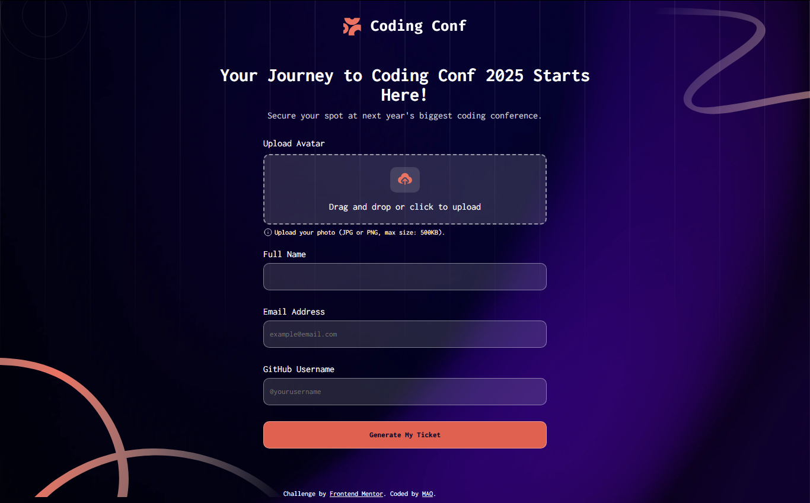

# Frontend Mentor - Conference ticket generator solution 🎟️

## Table of contents

- [The challenge](#the-challenge)
- [Screenshot](#screenshot)
- [Links](#links)
- [My process](#my-process)
  - [Built with](#built-with)
  - [What I learned](#what-i-learned)
  - [Continued development](#continued-development)
  - [Useful resources](#useful-resources)
- [Author](#author)
- [Acknowledgments](#acknowledgments)

## The challenge

This project was undertaken to solidify my knowledge of core front-end technologies (HTML, CSS, and Vanilla JavaScript). The challenge was to create a dynamic web application that allows users to easily generate personalized digital tickets. This involved incorporating key features such as client-side form validation, robust drag-and-drop image uploads, and local data persistence, all while ensuring a responsive user interface across various devices.

## Screenshot

## Links

[Click to view the live application!](https://abdulshakur03.github.io/FEM--conference_ticket_generator/)
[Explore the code on GitHub](https://github.com/abdulshakur03/FEM--conference_ticket_generator)

## My process

I faced a significant challenge with implementing the drag-and-drop image upload, particularly in handling file input and displaying the selected image dynamically. Through dedicated research and experimentation, I successfully implemented this functionality. While certain aspects of the implementation still present learning opportunities, this experience reinforced the importance of continuous learning and problem-solving in development.

- Built with

* HTML5 (Semantic HTML)
* CSS3 (Flex-box, Media Queries for responsiveness)
* JavaScript (Vanilla JS for DOM manipulation, event handling, localStorage)

- What I learned

  - Implementing robust drag-and-drop functionality for avatar uploads, including file type validation.
  - Persisting user data and generated ticket information using localStorage to enhance user experience across sessions.
  - Using CSS Media Queries to ensure the layout adapts seamlessly from desktop to mobile views.

- Continued development
    _ Integrate a React frontend to improve component reusability and state management.
    _ Add a backend (e.g., using Python/Flask) to store tickets in a database instead of localStorage.
    _ Allow users to download their generated ticket as an image (e.g., PNG).
    _ Implement more advanced validation rules.

  ## Author

  Mahmood Abdulshakur Olamidipupo - [GitHub Profile](https://github.com/abdulshakur03)

* University of Ilorin, Kwara State, Nigeria

## Acknowledgments

* Inspired by various Frontend Mentor challenges and online tutorials.
